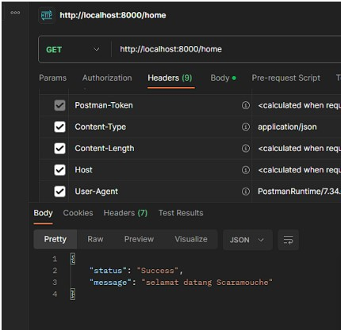

REGISTER, AUTHENTICATION DAN AUTHORIZATION
------------------------------------------------
Langkah 1) Untuk membuat user baru dengan PHP, kita perlu memastikan bahwa tabel user sudah
ada. Kemudian, kita membuat file AuthController.php untuk mendaftarkan user baru.
Terakhir, kita menambahkan router baru di file routes/web.php untuk mengarahkan
permintaan ke fungsi register() di dalam kelas AuthController.

Langkah 2) Dengan menambahkan fungsi login() pada file AuthController.php dan router baru pada
file routes/web.php, kita bisa membuat fungsi login untuk membaca user dengan email
scaramouche@fatui.org dan password wanderer ke dalam database pada Postman.

Langkah 3) Dengan mengikuti langkah-langkah di atas, kita dapat menambahkan kolom token ke
tabel users dan menggunakannya untuk menyimpan token login user.

Langkah 4) Dengan mengikuti langkah-langkah di atas, kita dapat membuat middleware "auth" untuk
memeriksa apakah user sudah login. Kita juga dapat menambahkan route "/home" yang
hanya dapat diakses oleh user yang sudah login.

